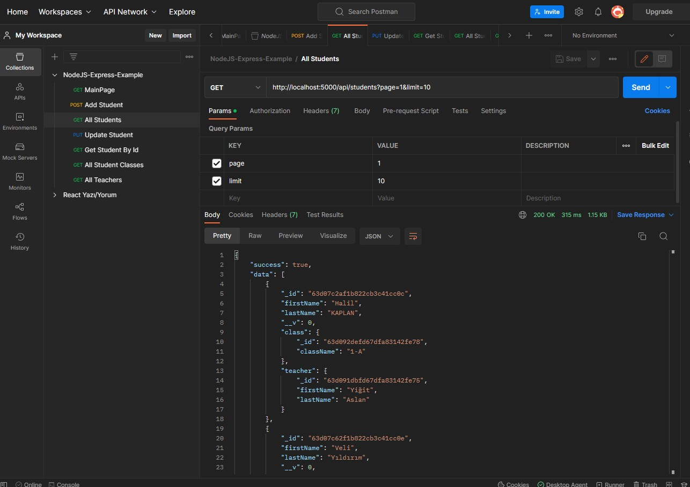
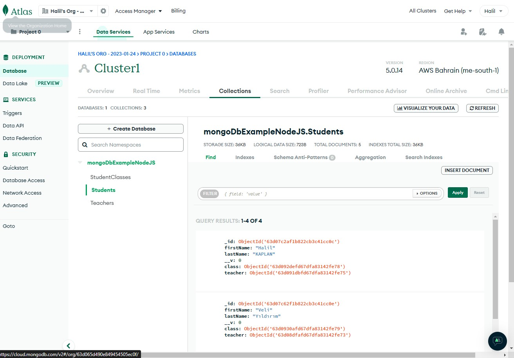
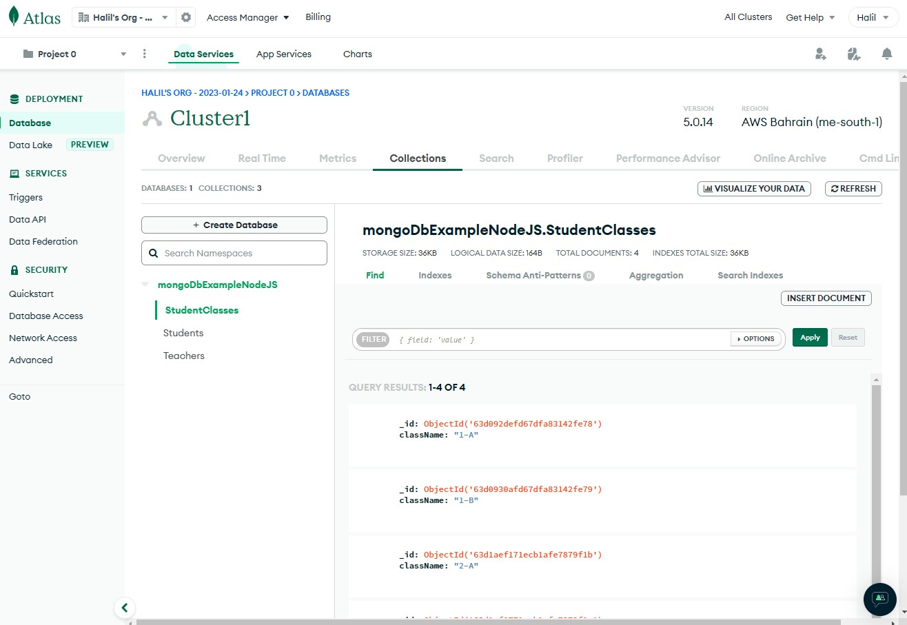
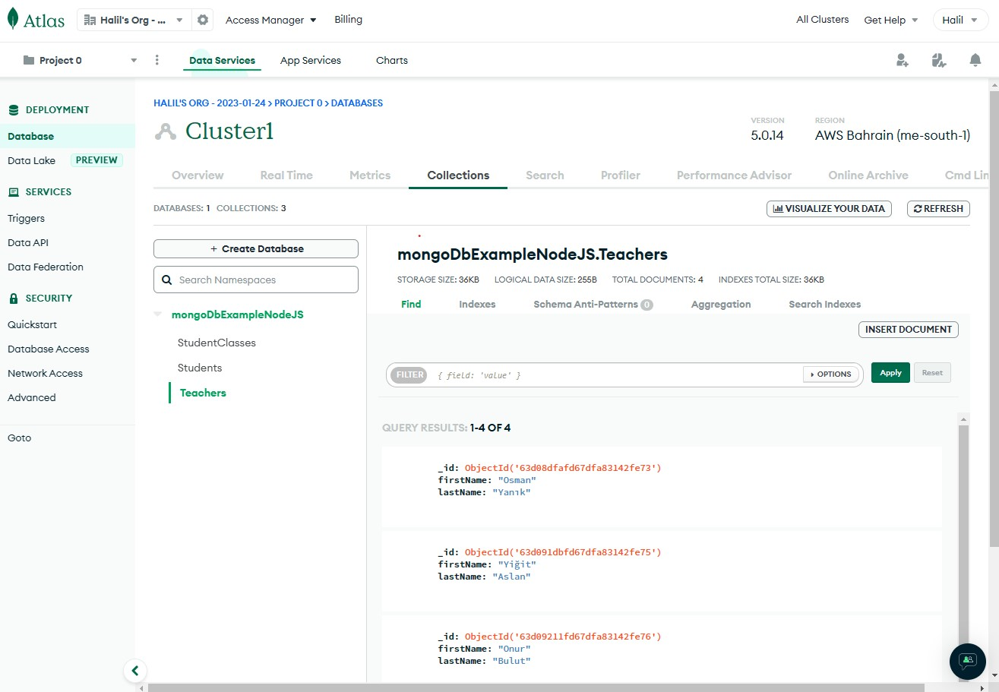

# MongoDB ExampleAPI NodeJS

## Description

It is an example of a simple API using NodeJS, Express and MongoDB. Mongoose, nodemon, and dotenv packages are also used. With this API, requests can be sent, adding records and fetching data with PostMan.

## Installation

NodeJS must be installed for the project to work.

- Download and install **node** (and **npm**): https://nodejs.org/en/
- Postman can be downloaded for API control:
https://www.postman.com/downloads/
You can also use the collection set in the `doc/Postman_collection.json` file.
- Make sure you have an editor (I used VSCode: https://code.visualstudio.com/)


### Install dependencies

Open a terminal or command prompt inside the project folder, then install the dependencies.

```Bash
# Follow this command to add the node_modules folder.
$ npm install
```

### Start the API

```Bash
# Follow this command to run the API.
$ npm start
```

### Sending request

Try the following url with Postman.
```bash
http://localhost:5000/api/students?page=1&limit=10
```



### MongoDB collections

3 collections are used for this API.

`Students`


`StudentClasses`


`Teachers`
